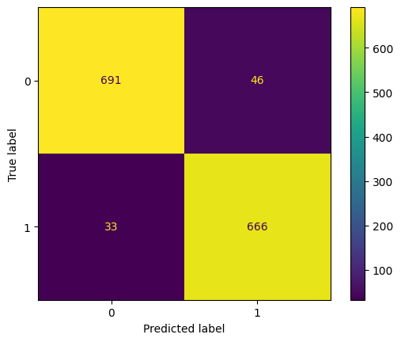

# Antimicrobial Drug Resistance Prediction

This project utilizes machine learning models to predict antimicrobial resistance (AMR) based on genomic and DNA sequence data. The goal is to accurately classify microorganisms that may contain AMR markers, using multiple models to identify patterns in the data.

## Table of Contents
- [Overview](#overview)
- [Installation](#installation)
- [Usage](#usage)
- [Results](#results)
- [Model Performance](#model-performance)

## Overview

Antimicrobial resistance is one of the biggest threats to global health today. This project aims to contribute by building machine learning models that can predict AMR from genomic data.

## Installation

1. Clone the repository:

   ```bash
   git clone https://github.com/IamFaisal11/antimicrobial_drug_resistance.git
   
2. Install the required dependencies:

   ```bash
   pip install -r requirements.txt
   
## Usage
   To train the models and evaluate performance, run the appropriate cells in this notebook
   
## # Antimicrobial-Drug-Resistance



